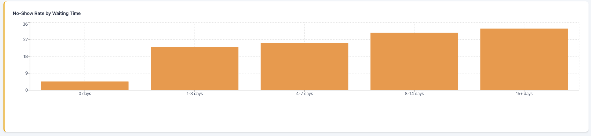
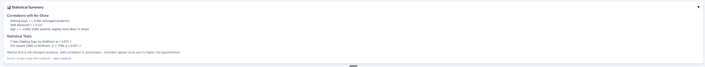

# TruBridge Patient No-Show Analysis (EDA + dashboard)

**Live dashboard:** https://patient-noshow-dashboard.vercel.app/  
**Repo:** https://github.com/ivan-711/Externship-TruBridge  
**Colab notebook:** https://colab.research.google.com/drive/1Yb-MIOGAxo0x3LVX7mIhcRuF0lFKLEs_?usp=sharing
**One-pager (PDF):** docs/one-pager/TruBridge_NoShow_OnePager_IvanFlores.pdf

Patient no-show analysis built from the Kaggle “Medical Appointment No Shows” dataset (May 2016).  
I cleaned the raw data, engineered `WaitingDays`, ran basic statistical tests, trained a baseline logistic regression model, and published findings in a React dashboard.

---

## What’s included

- **Final Colab notebook** (cleaning + EDA + stats + baseline model)
- **Datasets**
  - `publicsafefinalnoshowdataset.csv` (public-safe: removed `PatientId` and `AppointmentId` for the dashboard)
- **React dashboard** (Vite + React)

---

## Key questions

- How does **waiting time (lead time)** relate to no-shows?
- Do **SMS reminders** correlate with no-show rate?
- Which **age groups** have higher no-show rates?
- Do no-shows shift **week-to-week**?

---

## Data + target

- **Source:** Kaggle “Medical Appointment No Shows” (May 2016)
- **Target:** `NoShow` (0 = show, 1 = no-show)
- **Key fields used:** `Age`, `SMS_received`, `ScheduledDay`, `AppointmentDay`
- **Feature engineered:** `WaitingDays = AppointmentDay - ScheduledDay` (days)
- **Cleaning rules (high level):**
  - Dropped negative waiting days
  - Kept waiting days in a realistic window (0–365)

---

## Results snapshot

- No-show rate: **~20%**
- WaitingDays is higher for no-shows (mean show ≈ **8.75** days vs mean no-show ≈ **15.84** days; p-value < **0.001**)
- `SMS_received` is associated with different no-show rates (chi-square statistic ≈ **1767.98**, p-value < **0.001**)  
  *Association only. This does not prove SMS causes no-shows.*

---

## Baseline model (logistic regression)

- Features: `Age_normalized`, `WaitingDays_normalized`, `SMS_received`
- Baseline accuracy (predict all “show”): **~0.7981**
- Model accuracy: **~0.7960**
- Takeaway: class imbalance + limited feature signal with this small feature set

---

## Dashboard screenshots

**Overview**  
  


**Charts**  
  
  
  
  


**Summary**  


---

## Repo structure

- `patient-dashboard/` → React + Vite dashboard app
- `*.csv` → cleaned datasets used for analysis + dashboard

---

## Run the dashboard locally

```bash
cd patient-dashboard
npm install
npm run dev
